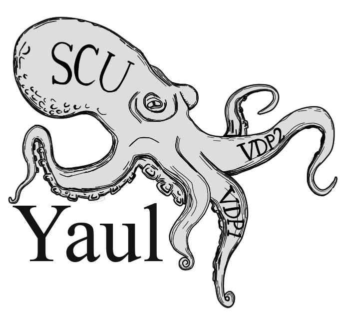

Yet Another Useless [Saturn] Library
===

  

  
  
  
  

## About

Yaul is an open source development kit for the SEGA Saturn. The SDK as a whole
aims to minimize the _painful_ experience that is developing for the Saturn by
providing lightweight abstractions between your program and the hardware.

## Documentation

Visit [yaul.org][1].

## Installation

### Windows

  
MSYS2

If you already have MSYS2 installed, follow the directions below to setup access
to the package repository. If not, download and install MSYS2 [here][7] first,
then continue to follow the instructions below.

1. From the Start menu, open _MSYS MinGW 64-bit_.

2. Open `/etc/pacman.conf` and at the end of the file, add the following:

       [yaul-mingw-w64]
       SigLevel = Optional TrustAll
       Server = http://packages.yaul.org/mingw-w64/x86_64

3. Go back to the shell and sync and refresh the databases.

       pacman -Syy

4. Install everything.

       pacman -S \
         yaul-tool-chain-git \
         yaul-git \
         yaul-emulator-yabause \
         yaul-emulator-mednafen \
         yaul-examples-git

5. Once all the packages have been installed, close the existing shell and start
   a new one.

6. Test your environment by [building an example](#building-and-running-an-example).

### Linux

  
Arch

Follow the directions below to setup access to the Arch Linux package
repository, or build the [packages][6] yourself.

1. As `root`, open `/etc/pacman.conf` and at the end of the file, add the
   following:

       [yaul-linux]
       SigLevel = Optional TrustAll
       Server = http://packages.yaul.org/linux/x86_64

2. Sync and refresh the databases.

       pacman -Syy

3. Install everything.

       pacman -S \
         yaul-tool-chain-git \
         yaul-git \
         yaul-emulator-mednafen \
         yaul-emulator-kronos \
         yaul-examples-git

4. Once all the packages have been installed, close the existing shell and start
   a new one.

5. Test your environment by [building an example](#building-and-running-an-example).

  
Debian based

There are currently no `.deb` packages available. You will
need to [build Yaul](#building-tool-chain-from-source).

### MacOS X

There are currently no packages available. You will
need to [build Yaul](#building-tool-chain-from-source).

### Docker

A [`Dockerfile`][8] file is available.

## Building tool-chain from source

Follow the instructions found in the [`build-scripts/`][5] directory. Please
note that you still need to [build Yaul](#building-yaul-manually).

## Setting and building Yaul manually

  
Cloning the repository

1. Clone the respository

       git clone "https://github.com/ijacquez/libyaul.git"

2. Initialize the submodules

       git submodule init

3. Update the registered submodules

       git submodule update

  
Setting up the environment file

1. Copy the template `/opt/tool-chains/sh2eb-elf/yaul.env.in` to your home
   directory as `.yaul.env`. This is your environment file.

2. Read the environment file `.yaul.env` into your current shell.

       source $HOME/.yaul.env

3. Reading the environment file needs to be done every time a new shell is
   opened. To avoid having to do this every time, add the line below to your
   shell's startup file.

       echo 'source $HOME/.yaul.env' >> $HOME/.bash_profile

   If `.bash_profile` is not used, use `.profile` instead. This is dependent on
   your set up.

  
Configuring the environment file

Open `$HOME/.yaul.env` in a text editor and change the following to define your environment:

   1. Set the absolute path to the tool-chain in `YAUL_INSTALL_ROOT`.
   2. If necessary, set `YAUL_PROG_SH_PREFIX` and `YAUL_ARCH_SH_PREFIX`.
   3. Set the absolute path to where the `libyaul` source tree is located in
      `YAUL_BUILD_ROOT`.
   4. Enable RTags/Irony/ccls support by setting `YAUL_CDB` to 1. To disable,
      set to 0 (zero).

   Setting the wrong values may result in compilation errors.

  
Building

1. Build and install the supported libraries.

       SILENT=1 make install-debug

   If any given library in Yaul is being debugged, use the `install-debug`
   target instead. Either _release_ or _debug_ can currently be installed at one
   time. It's possible to switch between the two in the same installation.

   To find more about other targets, call `make list-targets`.

2. Build and install the tools.

       SILENT=1 make install-tools

3. Test your environment by building an
   [example](#building-and-running-an-example).

## Building and running an example

1. If you've built Yaul manually, check out any example in the [`examples`][4]
   submodule. Otherwise, go to `/opt/yaul-examples/`.

2. Copy the `vdp1-zoom-sprite` directory to your home directory

       cp -r /opt/yaul-examples/vdp1-zoom-sprite $HOME/

3. Build `vdp1-sprite`

       cd $HOME/vdp1-zoom-sprite
       SILENT=1 make clean
       SILENT=1 make

4. Use Mednafen to test the example.

       mednafen vdp1-zoom-sprite.cue

   If Mednafen is unable to find the Sega Saturn BIOS image, please confirm that,

     1. The file is named `mpr-17933.bin` and that it exists relative to the
        `firmware` directory under the [Mednafen base directory][9].

     2. The calculated MD5 hash of the file is `3240872c70984b6cbfda1586cab68dbe`.

5. Success! :tada:

## Contact

You can find me (*@mrkotfw*) on [Discord]( https://discord.gg/S434dWA).

[1]: https://yaul.org/
[4]: https://github.com/ijacquez/libyaul-examples
[5]: https://github.com/ijacquez/libyaul-build-scripts
[6]: https://github.com/ijacquez/libyaul-packages
[7]: https://www.msys2.org/
[8]: https://github.com/ijacquez/libyaul-docker
[9]: https://mednafen.github.io/documentation/#Section_base_directory
